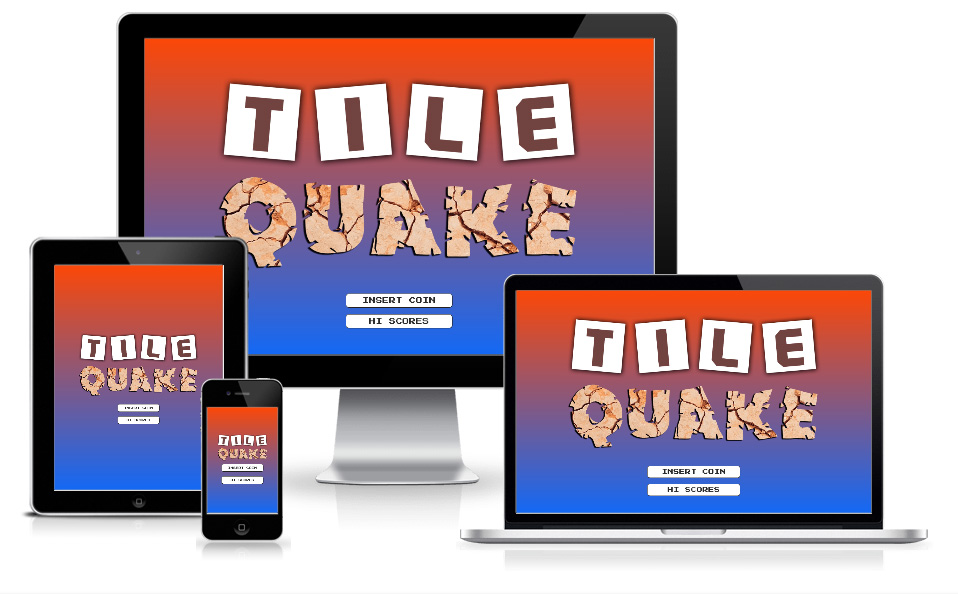

# Tile Quake
The purpose of the ‘Tile Quake’ project is to create a simple fun to play puzzle-slide game that can be played by ages 5 and above.

The live deployed site can be accessed using the following link: [Tile Quake](https://devtoguk.github.io/milestone-2-TILE-QUAKE/)

## Business Goals

- Create a fun, easy to play puzzle slide game with a retro feel.
- Play the game.
- Have fun (the game must not be too hard to complete).
- Get on the hi-scores table.
- Keep trying to better your scores.
 
## Customer Goals
- Play the game.
- Have fun (the game must not be too hard to complete).
- Get on the hi-scores table.
- Keep trying to better your scores.

## UX

### Ideal User:
- English speaking
- Looking for a simple or challenging game to play.

### How will this user enjoy playing the game
- Easy to set game options.
- Allow the use of their own image as the puzzle.
- Simple to play.
- Has difficulty levels for all ages and abilities.
- Keep coming back to try and beat their previous best scores.

## User Story
1. How do I play the game?
2. I need to set the game options for skill and select a puzzle image.
3. I want to play the game.
4. I need to be able to see in-game information about how I’m doing.
5. How do I complete the puzzle.
6. If I get stuck I would like to reset the game.
7. I want to end my current game and change the game setup.
8. I want to use an image on my device as the puzzle image.
9. I want to view the high-score table.
10. How do I get on the high-score table.

## Wireframe Designs

Click the link below to view a PDF file containing all the wireframe screen designs for Desktop, Tablet & Mobile.  

[Wireframe PDF](https://devtoguk.github.io/milestone-2-TILE-QUAKE/docs/wireframes.pdf)  (ctrl-click to open in a new tab)   

## Surface
I always wanted this game to have a retro 80’s arcade feel about it so the Google font ‘Press Start 2P’ designed
by CodeMan38 suited the theme perfectly.

Where possible bold colors were used to reflect the retro feel, the gradient orange/yellow screen dividers were
inspired by 80’s arcade game Bomb Jack.

The two in-game buttons were also styled to have an arcade look.

The blue and green of the game-play screen are meant to reflect the sea and land respectively.

Most sounds from the game are also taken from retro arcade games.

## Core Game Logic
For me probably the biggest challenge before writing a single line of code was to figure out whether or not a puzzle tile
was allowed to move, basically is a puzzle tile next to the blank tile?
Using traditional pen and paper I set about trying to solve the problem and after going down a few blind-alleys I came up
with this solution [[PDF scan of workings]](https://devtoguk.github.io/milestone-2-TILE-QUAKE/docs/core-game-logic.pdf).  The PDF shows a 3x3 grid
where I have manually filled in the grid side-codes for top, bottom, left & right for each grid position, starting with the
code 101 and giving sides that touch the same code. I then wrote out all the side-codes for each grid position(x,y) to help
me find a pattern so I could automatically generate the codes for each grid position.  I could have just hard-coded the
side-codes into an array, but as I was looking at the possibility of having different sized puzzle grids, creating a method to
generate the codes would be a better idea.  The method which generates the codes is **initPuzzle**.

With the side-code information in the tileGrid array I could quickly check if any of the sides of the the tile the user
clicked on, matched any of the sides of the blank tile and if they did then that tile was allowed to move!

## Technologies Used
- HTML
- CSS
- JavaScript
- [Google Fonts](https://fonts.google.com/) - for the website font 'Play'.
- [GitPod](https://www.gitpod.io/) - online IDE used to create this project.
- [Autoprefixer](https://autoprefixer.github.io/) - used to ensure the CSS code was valid for browsers which match (last 2 versions, > 5%)
- [Optimizilla](https://imagecompressor.com/) - used to compress JPEG/PNG content.
- [CSS Gradient](https://cssgradient.io/) - used to help create the gradients.

For this project I decided to use CSS-Grid for layout, as I did not believe this project warranted the extra overhead
of Bootstrap.  I also chose not to use jQuery as I wanted to become more familiar with the pure Javascript methods of
achieving things like DOM manipulation.

## Features
The game runs from a single page, using CSS animation to show the user the next screen.  As the game follows a determined 
path I chose not to show the same navigation on each page, instead using simple buttons to guide the user through the game. 

### Welcome screen
The welcome screen has a large Tile Quake logo on a colored gradient background to create an opening screen with impact.
The user is presented with two simple buttons [INSERT COIN] (to start) and [HI SCORES] (to view the high-score table)

Desktops, tablets and mobiles all display in the same format.

### Hi Scores screen
The hi-scores screen shows the user the top 10 hi-scoress, the initials of who made the scores and the level they were
playing. These scores are stored locally on the device. The hi-scores screen will timeout after several seconds and return the
user back to the welcome screen. At the bottom of the screen is a [BACK] button which will also take the user back to the
welcome screen.

If you complete the puzzle and get a hi-score, this screen is automatically displayed and the user can input there initials
next to their score and use the [SAVE SCORE] to save the score.

Desktops, tablets and mobiles all display in the same format.

### Game Setup screen

The game setup screen displays the setup options the user can change: difficulty level slider and puzzle image. One of the
stock puzzle images can be used or the user can select an image from their device to use as the puzzle by using image 16/16. 
Instructions on how to play the game are shown on the right hand of the screen.  At the bottom of the screen there is a 
[PLAY GAME] button which will start the game.

On mobiles the [PLAY GAME] button is moved to the top of the screen area and the instructions are displayed at the bottom.

### Game Play screen
The game play screen shows the actual game.
In the left hand panel there is the Tile Quake logo and below that some in-game information: puzzle image preview, difficulty level,
game timer and number of moves made.  In the right hand panel two buttons are displayed [RESET] and [QUIT], these buttons allow the
user to reset the existing puzzle or quit the game and return to the welcome screen. When this screen first displays the puzzle is
complete, the tiles start to shake and the puzzle is shuffled depending on the difficulty level, the timer then starts to run down.
Now the user needs to complete the puzzle as soon as possible, the quicker they solve the puzzle using the least moves possible the
higher their score will be. 

On mobiles the Tile Quake logo and the game information are displayed at the top of the screen and the [RESET] and [QUIT] button are
displayed at the bottom of the screen.

### Puzzle Complete overlay (faded overlay onto the Game Play screen)
This screen is displayed if the user completes the puzzle. Different music will be played depending on if the user has a hi score.
Their score will be displayed calculated on base score, time bonus and move bonus, if the score is high enough to go on the hi-scores
table the user is taken to the hi-scores screen where they can input their initials.

## Future Features/Changes
- Use of a remote database to allow a shared hi-scores table so you could try and beat your friends scores.
- Use an API to access an on-line image library for puzzle images
- Have the option for bigger grid size such as 4x4 and 5x5. (this was in my original design but due to the extra complexity and
time constraints I decided to consider this feature for a future version)

## Testing
For testing information please use the following link [TESTING.md](/TESTING.md)

## Deployment
The live project was deployed using GitHub Pages, this was done using the procedure below:

- Login to GitHub.
- Navigated to the projects repository “milestone-2-TILE-QUAKE”
- Click Settings under the repository name.
- Scroll down to the “GitHub Pages” section.
- Under Source choose ‘master branch’.

The Source section will now read:
“ Your GitHub Pages site is currently being built from the master branch. ”

When the site is deployed and ready to access, it will then read:
“ Your site is published at https://devtoguk.github.io/milestone-2-TILE-QUAKE/ ”

The live site can now be accessed using the link below:  
https://devtoguk.github.io/milestone-2-TILE-QUAKE/

### Running this project locally
If you wish to work on / run this project locally then use the cloning procedure below:

- Login to GitHub.
- Navigate to the projects repository “milestone-2-TILE-QUAKE”
- Click Clone or Download under the repository name.
- To clone the repository using HTTPS, under “Clone with HTTPS”, click the [copy to clipboard] icon next to the URL field.
- Open Git Bash on your local IDE.
- Change the current working directory to the location where you want the cloned directory to be made.
- Type ‘git clone’ and then paste the URL from the step above.
```
    git clone https://github.com/username/repository
```
- Press Enter. Your clone will now be created.

For more information and troubleshooting on cloning a repository from GitHub click [here](https://help.github.com/en/github/creating-cloning-and-archiving-repositories/cloning-a-repository).

## Credits

### Text content
Apart from character names all text content has been written by R.Thompson and proof read by E. Thompson. 
All character names remain the property of their respective copyright owners.

### Logo
The logo image was created from scratch using Adobe Photoshop.  
(the cracked Earth effect was cropped from an image by Micaela Parente on [Unsplash](https://unsplash.com/photos/UzTBnxFiSWE)

### Photos
Puzzle image photos have been downloaded from [Unsplash](https://unsplash.com/) and Google images.
These images remain the property of their respective copyright owners.
(if this was not an educational project, permission would have been sought before using any unlicensed images from Google)

### Audio
The audio files for the game are mainly samples from games I remember as a teenager such as Star Force, Bomb Jack and Galaga. These audio files
were downloaded from a website I found called [Video Game Music](https://downloads.khinsider.com/). 
The actual tile quake sound was downloaded from [Zapsplat](https://www.zapsplat.com/).
(if this was not an educational project, permission would have been sought before using any audio files)

### Code
Thanks to the Stackoverflow and other communities & blogs for helping solve some issues/problems. 
- Fisher-Yates (aka Knuth) Shuffle. [Stackoverflow thread](https://stackoverflow.com/questions/2450954/how-to-randomize-shuffle-a-javascript-array)
- Using a DIV to get screen width with offsetWidth. [Stackoverflow thread](https://stackoverflow.com/questions/4787527/how-to-find-the-width-of-a-div-using-vanilla-javascript)
- Resizing an image using javascript. [TheRogerLab](https://www.therogerlab.com/how-can-i/javascript/resize-an-image.html)
- JavaScript Fetch API to Get JSON Data. [Tania Rascia](https://www.taniarascia.com/how-to-use-the-javascript-fetch-api-to-get-json-data/)
- Browser detection. [jlubean](http://jsfiddle.net/jlubean/dL5cLjxt/)
- Slider bar styling. [Daniel Stern](https://css-tricks.com/styling-cross-browser-compatible-range-inputs-css/)
- Fireworks effect on puzzle complete with hi-score. [Eddie Lin](https://jsfiddle.net/elin/7m3bL/)
- The [RESET] and [QUIT] buttons were tweaked from an original style by Rumyra [The Big Red Panic Button](https://codepen.io/Rumyra/pen/GDLpJ)

## Acknowledgments
Inspiration for this project originally came from an image my sister posted on social media showing loads of things from the 70's / 80's
one of which was of an old toy slide-puzzle game, so when thinking about what todo for my MS2 I saw on Slack that some others were doing
games and immediately the slide-puzzle popped back into my head.

My mentor suggested looking at BEM for this project which I have done and implemented on a basic level, I have not gone for the full BEM
on my project as I think it can be a little restrictive in areas, so my CSS is slightly BEM.

Thank you to the free JavaScript courses JavaScript 30 by Wes and Watch and Code's Practical JavaScript by Gordon Zhu both of which were
very helpful additional learning. 

A big thank you to my mentor, the Slack community and many great reference sites out there including Stackoverflow and W3Schools.

## Disclaimer
The content of this website is solely for educational purposes.
